# TicketBox

TicketBox is an end-to-end concert ticketing platform for audiences, event
organizers, and gate staff. It combines ticket discovery and checkout,
organizer operations, signed QR tickets, VIP guest management, and resilient
online/offline check-in in one repository.

## Product Screens

### Audience concert discovery

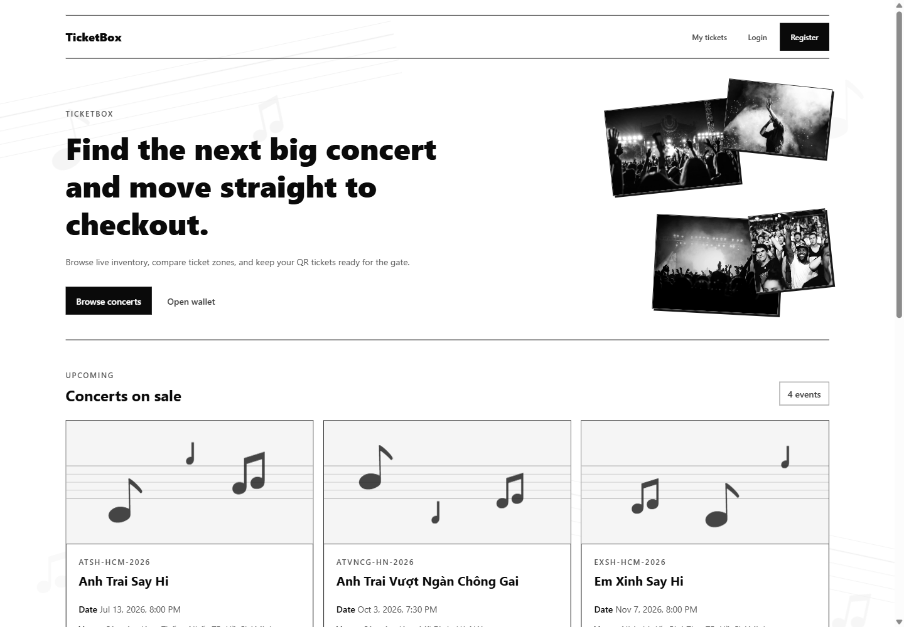

### Ticket selection and venue map

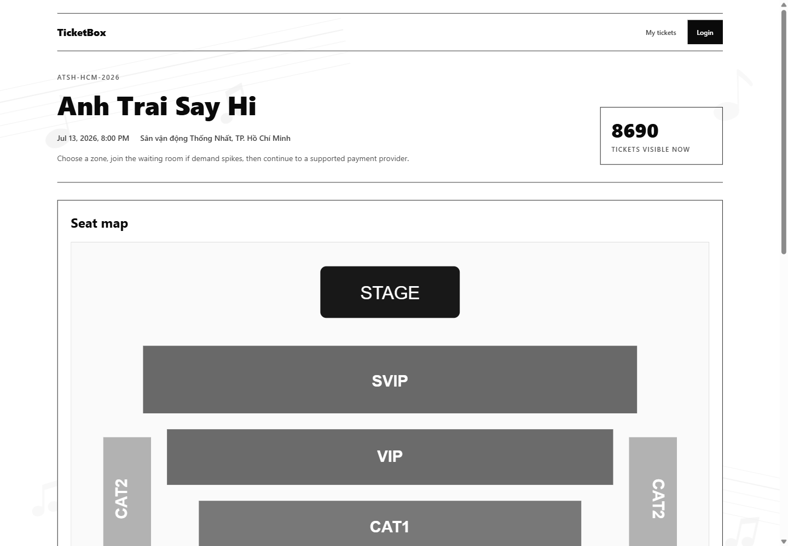

### Organizer operations

<table>
  <tr>
    <td align="center" width="50%">
      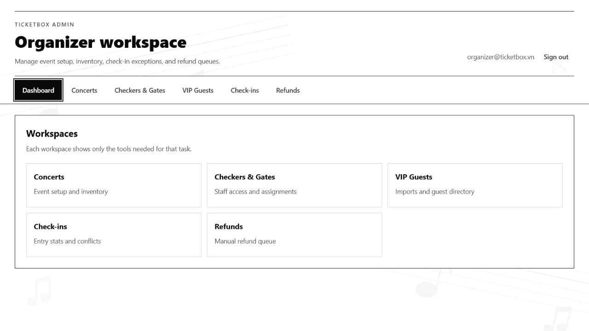
      <br /><strong>Dashboard</strong>
    </td>
    <td align="center" width="50%">
      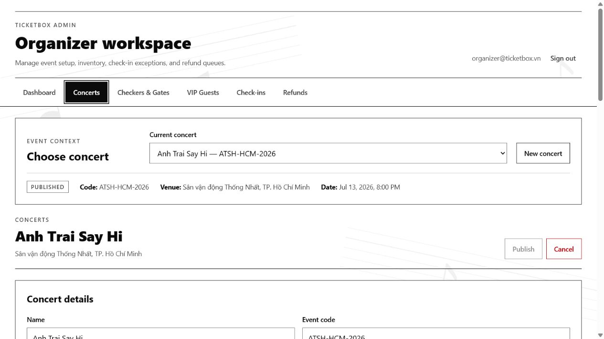
      <br /><strong>Concerts</strong>
    </td>
  </tr>
  <tr>
    <td align="center" width="50%">
      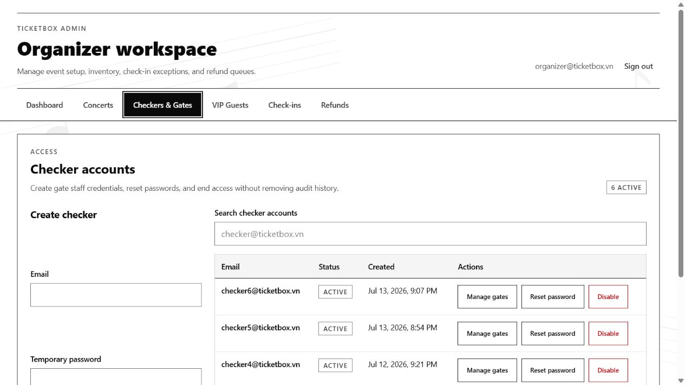
      <br /><strong>Checkers &amp; Gates</strong>
    </td>
    <td align="center" width="50%">
      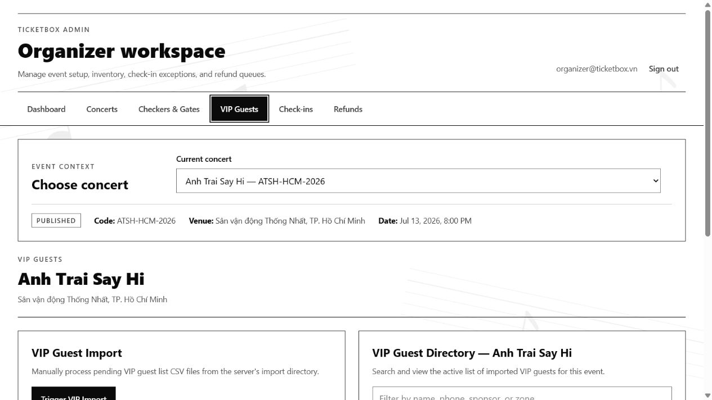
      <br /><strong>VIP Guests</strong>
    </td>
  </tr>
  <tr>
    <td align="center" width="50%">
      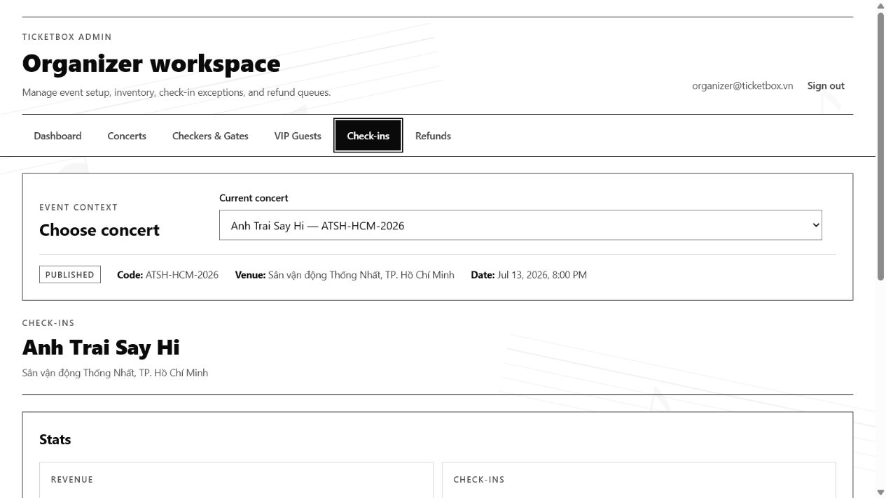
      <br /><strong>Check-ins</strong>
    </td>
    <td align="center" width="50%">
      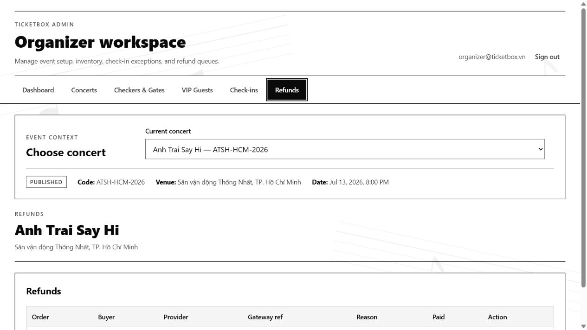
      <br /><strong>Refunds</strong>
    </td>
  </tr>
</table>

### Gate checker

<table>
  <tr>
    <td align="center" width="50%">
      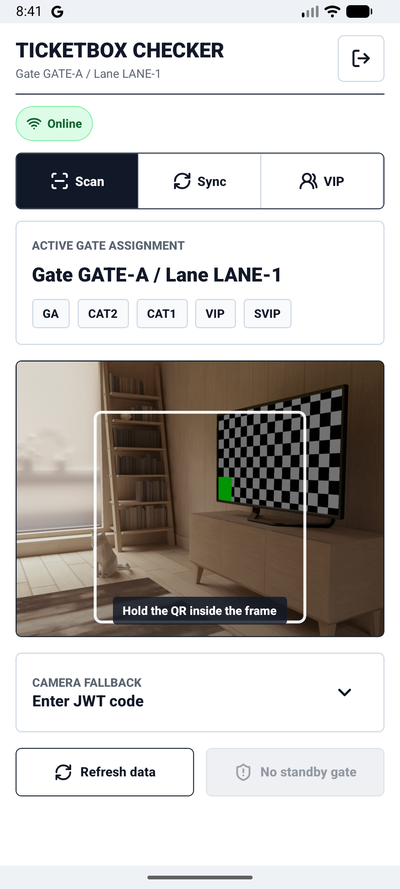
      <br /><strong>Live camera scan frame</strong>
    </td>
    <td align="center" width="50%">
      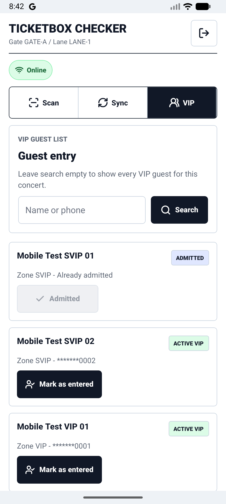
      <br /><strong>VIP guest entry</strong>
    </td>
  </tr>
</table>

## Capabilities

| Surface | Main capabilities |
| --- | --- |
| Audience web | Browse published concerts, inspect zones and availability, join sale queues, purchase tickets, track payment, and open QR e-tickets. |
| Organizer admin | Manage concerts and inventory, checker accounts and gates, VIP imports, check-in conflicts, artist bios, and refund queues. |
| Checker app | Select an event, cache assignments and verification keys, scan signed QR tickets, reject gate mismatches and local duplicates, sync offline check-ins, and admit VIP guests. |
| Platform services | Authentication, Redis-backed sale queues, idempotent purchase/payment handling, notifications, signed QR issuance, and audit history. |

## Architecture

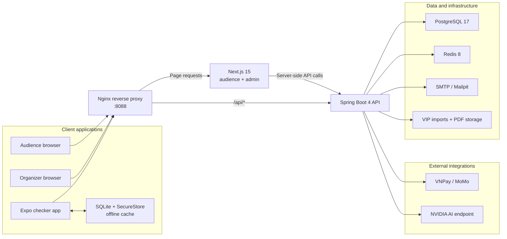

### Offline check-in path

1. The checker signs in online and caches its event assignment, accepted zones,
   and public verification keys. Local scan history remains on the device.
2. Every QR JWT is verified locally for signature, event, zone, expiry, and
   duplicate use already seen on that device before admission.
3. Offline admissions are stored in SQLite and shown immediately in the app.
4. When connectivity returns, queued check-ins sync idempotently with the API.
   The server resolves cross-device duplicates and keeps conflicts visible for
   gate staff and organizer review.

## Repository Layout

```text
ticket-box/
|-- api/                 Spring Boot API and Flyway migrations
|-- ticketbox-web/       Next.js audience and organizer interfaces
|-- ticketbox-checker/   Expo / React Native gate checker
|-- import-samples/      Repeatable VIP and artist-bio samples
|-- nginx/               Reverse-proxy configuration
|-- scripts/             App launcher
|-- docker-compose.yml   Local platform stack
`-- README.md            Setup, architecture, and product guide
```

## Quick Start

### Requirements

- Docker Desktop with Compose, or Docker Engine inside WSL 2.
- Node.js 22 or newer with Corepack.
- Android Studio and an Android Virtual Device for the checker app.

### First-time setup

Open PowerShell in the repository root:

```powershell
Copy-Item .env.example .env
Copy-Item ticketbox-checker\.env.example ticketbox-checker\.env
corepack pnpm install
```

### Start the web platform

```powershell
powershell -ExecutionPolicy Bypass -File .\scripts\run-app.ps1 -Target platform
```

The launcher uses Docker from Windows when available and otherwise falls back
to Docker Engine in the default WSL distribution. In WSL mode it keeps the
distribution alive while the containers run; `-Target stop` releases it.

### Start the checker

Start an Android Virtual Device, then run:

```powershell
powershell -ExecutionPolicy Bypass -File .\scripts\run-app.ps1 -Target checker
```

To start the platform first and then open the checker:

```powershell
powershell -ExecutionPolicy Bypass -File .\scripts\run-app.ps1 -Target all
```

Use `-NoBuild` when the Docker images are already current:

```powershell
powershell -ExecutionPolicy Bypass -File .\scripts\run-app.ps1 -Target platform -NoBuild
```

## Local URLs

| Service | URL |
| --- | --- |
| Audience web | `http://localhost:8088` |
| Organizer admin | `http://localhost:8088/admin/login` |
| API health | `http://localhost:8088/api/health` |
| Mailpit | `http://localhost:8025` |
| Direct API | `http://localhost:8080` |
| Direct Next.js app | `http://localhost:3000` |

Stop the stack through the same launcher:

```powershell
powershell -ExecutionPolicy Bypass -File .\scripts\run-app.ps1 -Target stop
```

## Demo Accounts

All seeded accounts use password `password`.

| Role | Email |
| --- | --- |
| Organizer | `organizer@ticketbox.vn` |
| Checker | `checker1@ticketbox.vn` |
| Checker | `checker2@ticketbox.vn` |
| Audience | `audience1@ticketbox.vn` |
| Audience | `audience2@ticketbox.vn` |
| Audience | `audience3@ticketbox.vn` |

## Checker Connectivity

Keep the following value in `ticketbox-checker/.env`:

```dotenv
EXPO_PUBLIC_API_BASE_URL=http://localhost:8088
```

The checker maps `localhost` to Android emulator host address `10.0.2.2`.
Restart Expo after changing any `EXPO_PUBLIC_*` variable.
