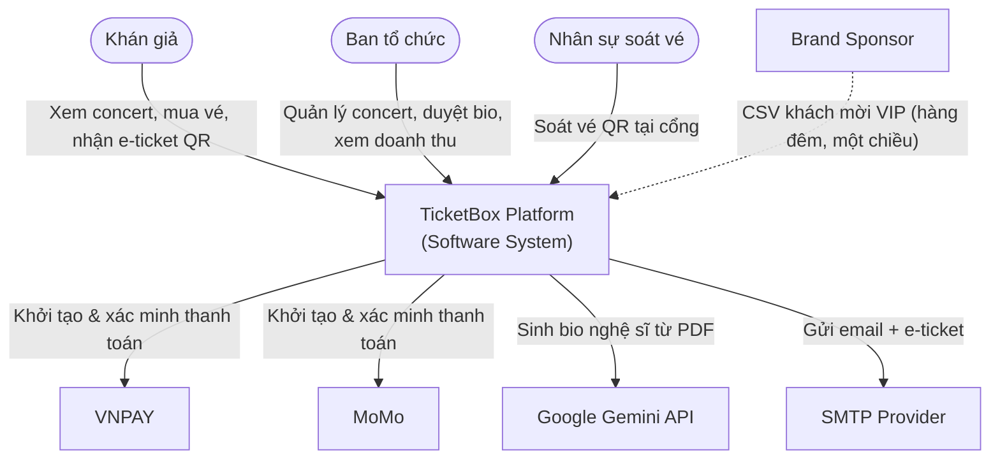
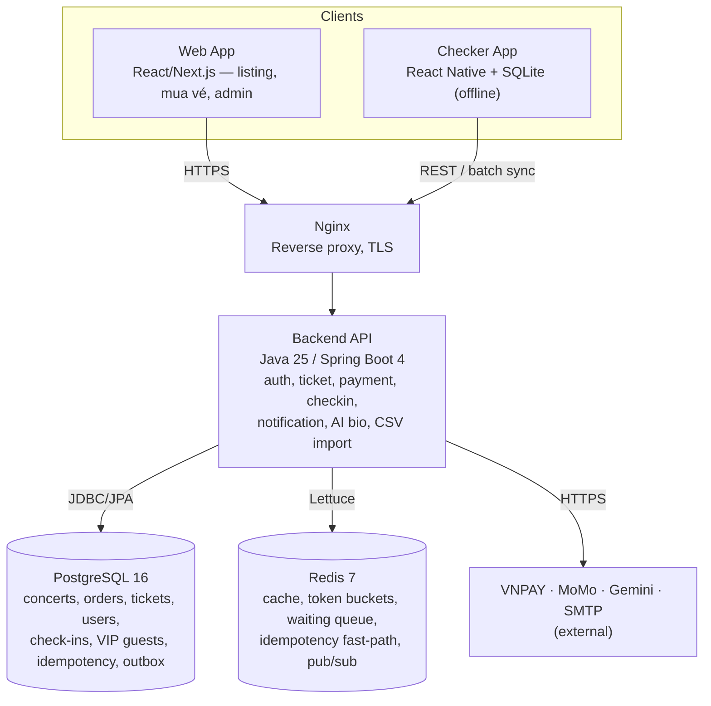
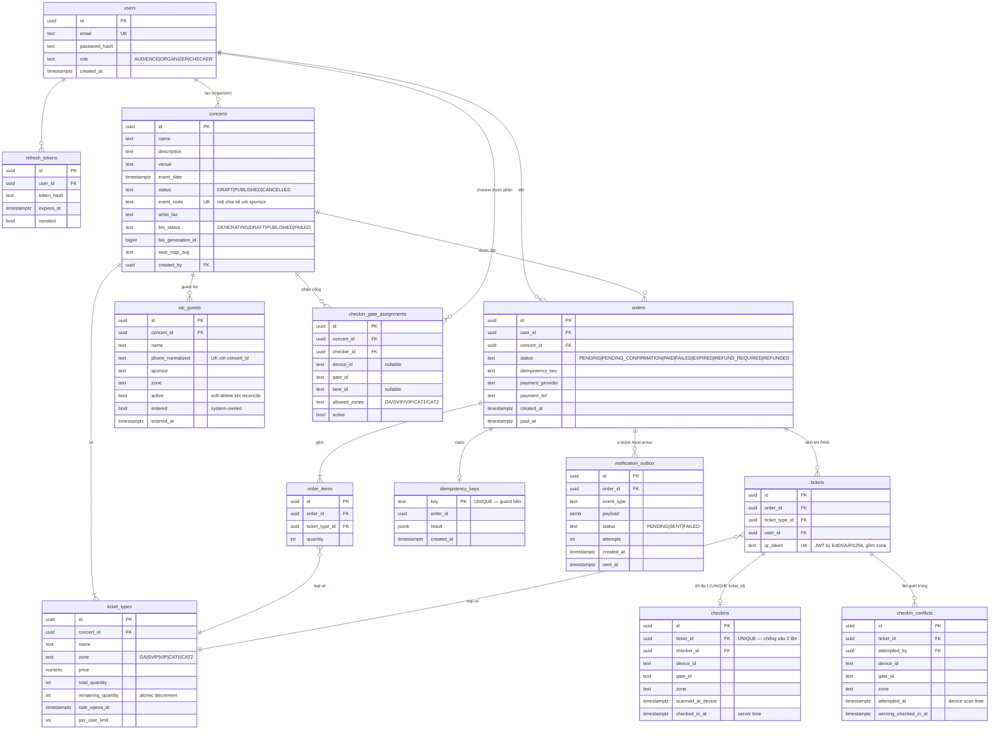
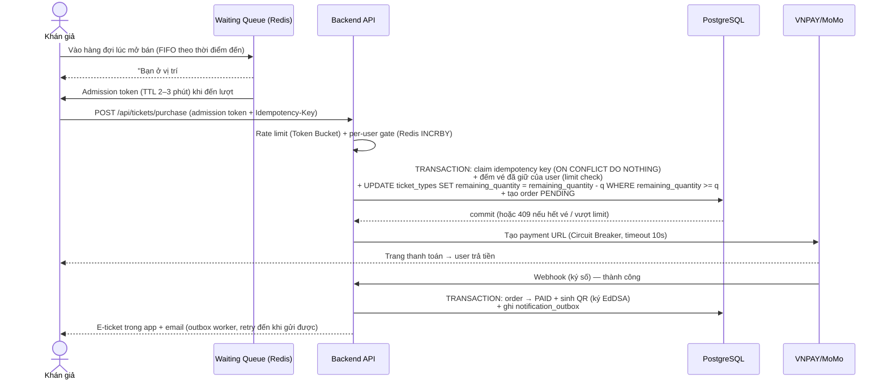

# TicketBox — Technical Design

> Tài liệu này trình bày thiết kế theo cấu trúc đề bài. Mỗi quyết định lớn có ADR đầy đủ (bối cảnh, phương án thay thế, trade-off) trong [`../../openspec/changes/ticketbox-platform/design.md`](../../openspec/changes/ticketbox-platform/design.md) (D1–D16); đặc tả hành vi từng tính năng (kịch bản chính / kịch bản lỗi) trong [`../../openspec/changes/ticketbox-platform/specs/`](../../openspec/changes/ticketbox-platform/specs/).

## 1. Kiến trúc tổng thể

**Architectural style: Modular Monolith** (ADR D1) — một ứng dụng Spring Boot duy nhất với ranh giới module rõ ràng (concert, ticket, payment, checkin, notification, admin, ai-bio, csv-import), triển khai sau Nginx, cùng hai client: web app (React/Next.js) và mobile app soát vé (React Native).

Lý do chọn thay vì microservices: đạt được lợi ích phân tách domain (ranh giới package, transaction cục bộ, dễ tách về sau) mà không phải trả chi phí vận hành phân tán (distributed tracing, service mesh, inter-service auth) — không tương xứng với quy mô đồ án. Toàn bộ hệ thống chạy bằng Docker Compose với 4 service: `api`, `postgres`, `redis`, `nginx`.

**Các thành phần và cách giao tiếp:**

| Thành phần | Công nghệ | Giao tiếp |
| :--- | :--- | :--- |
| Web App (khán giả + admin) | React / Next.js | HTTPS → Nginx → REST `/api/**` |
| Checker Mobile App | React Native + SQLite | REST khi online; ghi SQLite local-first, batch sync khi có mạng |
| Backend API | Java 25 / Spring Boot 4 | JDBC/JPA → PostgreSQL; Lettuce → Redis; HTTPS → VNPAY/MoMo/Gemini; SMTP |
| PostgreSQL 16 | Nguồn chân lý bền vững | Mọi dữ liệu nghiệp vụ + guard bền (idempotency, outbox) |
| Redis 7 | Tầng tốc độ | Cache-aside, rate limit, waiting queue, idempotency fast-path, Pub/Sub |

**Chuẩn REST API:** mọi endpoint backend đều nằm dưới prefix `/api/**`; các route không có `/api` như `/admin/**`, `/concerts/[id]`, `/orders/[id]` là route frontend. Contract endpoint chính:

| Nhóm | Endpoint | Quyền |
| :--- | :--- | :--- |
| Auth | `POST /api/auth/register`, `POST /api/auth/login`, `POST /api/auth/refresh` | Public / refresh-token flow |
| Public concert | `GET /api/concerts`, `GET /api/concerts/{id}`, `GET /api/concerts/{id}/availability` | Public cho PUBLISHED; `GET /api/concerts/{id}` trả DRAFT chỉ khi requester là owner ORGANIZER |
| Queue + purchase | `POST /api/queue/{concertId}/enter`, `GET /api/queue/{concertId}/status`, `POST /api/tickets/purchase` | AUDIENCE hoặc ORGANIZER; purchase dùng `Idempotency-Key` client gửi hoặc server sinh, và cần admission token khi queue active |
| Orders/e-ticket | `GET /api/orders/{id}`, `GET /api/orders/{id}/tickets` | Chủ order; ORGANIZER chỉ xem order thuộc concert mình sở hữu qua admin |
| Payment callback | `GET /api/payments/vnpay/callback`, `POST /api/payments/momo/callback` | Không dùng JWT; bắt buộc verify chữ ký gateway |
| Admin concert | `POST /api/admin/concerts`, `PUT /api/admin/concerts/{id}`, `DELETE /api/admin/concerts/{id}`, `POST /api/admin/concerts/{id}/publish`, `POST /api/admin/concerts/{id}/ticket-types`, `PUT /api/admin/concerts/{id}/ticket-types/{typeId}`, `GET /api/admin/concerts/{id}/stats`, `GET /api/admin/concerts/{id}/checkin-conflicts` | ORGANIZER + ownership |
| AI bio | `POST /api/admin/concerts/{id}/artist-pdf`, `GET /api/admin/concerts/{id}/artist-bio`, `PUT /api/admin/concerts/{id}/artist-bio`, `POST /api/admin/concerts/{id}/artist-bio/publish`, `POST /api/admin/concerts/{id}/artist-bio/reject` | ORGANIZER + ownership |
| Refund/admin orders | `GET /api/admin/orders?concertId=&status=`, `POST /api/admin/orders/{id}/mark-refunded` | ORGANIZER + ownership; refund money movement manual |
| Checker | `GET /api/checker/key-bundle?concertId=X`, `GET /api/checker/assignments?concertId=X`, `POST /api/checkins/{ticketId}`, `POST /api/checkins/batch`, `GET /api/vip-guests?concertId=&q=`, `POST /api/vip-guests/{id}/enter` | CHECKER only |
| VIP import | `POST /api/admin/vip-imports` | ORGANIZER; rows must resolve to concerts owned by requester |

**Khi một phần gặp sự cố, phần còn lại bị ảnh hưởng ra sao** (phân tích blast-radius):

| Sự cố | Ảnh hưởng | Phần vẫn hoạt động |
| :--- | :--- | :--- |
| VNPAY/MoMo lỗi kéo dài | Circuit Breaker mở → mua vé trả về "thanh toán tạm thời không khả dụng", **không trừ tiền** | Xem concert, số vé còn lại, soát vé, admin — hoàn toàn bình thường (graceful degradation) |
| Redis mất | Cache miss → đọc thẳng DB (chậm hơn); rate limit **fail-open** (ưu tiên availability); waiting queue **fail-closed** (đóng cổng mở bán thay vì thả herd không kiểm soát) | Tính đúng được giữ bởi guard bền trong PostgreSQL: idempotency UNIQUE constraint, per-user limit count trong transaction |
| Backend restart giữa chừng | Bio đang GENERATING được reaper thu hồi; e-ticket chưa gửi vẫn nằm trong outbox và được worker gửi lại; đơn PENDING được expiry job xử lý | Không mất dữ liệu nhờ trạng thái bền trong DB |
| Mất mạng tại cổng soát vé | App chuyển sang offline path: verify chữ ký QR bằng public key local, kiểm tra assignment cổng/khu đã cache, ghi SQLite, sync lại sau | Soát vé tiếp tục trong phạm vi cổng/khu được phân; chống quét trùng per-device vẫn đúng |
| Gateway webhook không đến | Đơn ở PENDING_CONFIRMATION, ghế giữ nguyên; job chủ động query API trạng thái giao dịch của gateway trước khi expire | Không double-charge, không oversell |

## 2. C4 Diagram

### Level 1 — System Context

Nguồn: [`diagrams/system-context.drawio`](diagrams/system-context.drawio)



### Level 2 — Container

Nguồn: [`diagrams/c4-container.drawio`](diagrams/c4-container.drawio)



## 3. High-Level Architecture

Nguồn: [`diagrams/high-level.drawio`](diagrams/high-level.drawio) — thể hiện luồng dữ liệu giữa các module backend, ba điểm tích hợp (payment gateway, Gemini API, CSV nhãn hàng) và luồng soát vé offline. Điểm đáng chú ý:

- **Đường mua vé** đi qua chuỗi bảo vệ: Waiting Queue (admit N/giây) → Token Bucket → atomic conditional UPDATE trên inventory → Payment Module (Circuit Breaker + Idempotency).
- **Soát vé offline** là local-first và gate-scoped: app tải assignment cổng/khu khi online, chỉ nhận vé đúng concert/zone của cổng đó, mọi scan hợp lệ ghi SQLite trước; sync queue đẩy lại backend khi có mạng.
- **CSV import** và **AI bio** chạy nền (`@Scheduled` / `@Async`), transaction tách biệt — lỗi của chúng không chạm đường mua vé.

## 4. Thiết kế cơ sở dữ liệu

**Lựa chọn: PostgreSQL (chính) + Redis (cache/lock) — ADR D2.**

- PostgreSQL: mua vé đòi hỏi *decrement inventory + tạo order* trong **một transaction ACID** — đây là lý do loại MongoDB. Chọn PostgreSQL thay vì MySQL nhờ `SELECT FOR UPDATE SKIP LOCKED` (expiry job nhặt đơn stale không tranh chấp với mua vé), `INSERT ... ON CONFLICT` (idempotent upsert), `unaccent()` (tìm khách VIP không dấu) và JSONB cho metadata sơ đồ ghế.
- Redis: mọi thao tác tần suất cao, độ trễ thấp, *được phép mất* — cache, bucket rate limit, hàng đợi chờ, fast-path idempotency. Nguyên tắc xuyên suốt: **Redis tăng tốc, PostgreSQL bảo đảm đúng** — mọi guard quyết định tính đúng đều có bản bền trong PostgreSQL.

### ERD các entity chính



Các ràng buộc gánh tính đúng (correctness-bearing):
- `ticket_types.remaining_quantity` — chỉ thay đổi qua `UPDATE ticket_types SET remaining_quantity = remaining_quantity - :qty WHERE id = :id AND remaining_quantity >= :qty` hoặc các release/admin-adjust path tương ứng (không bao giờ âm; không vượt `total_quantity`).
- `checkins.ticket_id` UNIQUE — một vé chỉ vào cổng một lần (toàn cục).
- `idempotency_keys.key` UNIQUE — một purchase attempt chỉ tạo một payment session, kể cả khi Redis chết.
- `vip_guests (concert_id, phone_normalized)` UNIQUE — danh tính khách mời neo theo SĐT chuẩn hóa, không theo tên.

## 5. Luồng nghiệp vụ quan trọng

### 5.1 Luồng mua vé (từ "Mua vé" đến e-ticket)



**Phản ứng khi lỗi giữa chừng:**

| Lỗi tại bước | Hệ quả & xử lý |
| :--- | :--- |
| Tạo payment URL timeout (user **chưa** trả tiền) | Order → FAILED, hoàn inventory + quota ngay; user chắc chắn chưa bị trừ tiền |
| User bỏ ngang sau khi có URL | Expiry job: PENDING quá 8 phút → EXPIRED, hoàn inventory + quota (nếu không có job này, vài nghìn checkout bỏ ngang khóa hết 200 ghế SVIP) |
| Đã trả tiền nhưng webhook không đến | Order → PENDING_CONFIRMATION, **ghế giữ nguyên**; trước khi expire (15 phút) job chủ động query API trạng thái giao dịch của gateway |
| Webhook thành công đến sau khi đơn đã EXPIRED | Ghế có thể đã bán lại → **không bao giờ** cấp lại ghế; order → REFUND_REQUIRED, organizer hoàn tiền thủ công, user được thông báo |
| Organizer hủy concert đã có vé PAID | Concert → CANCELLED; các order PAID của concert → REFUND_REQUIRED để xử lý hoàn tiền thủ công; không restore inventory vì sự kiện đã bị hủy |
| User bấm mua nhiều lần / retry | Idempotency key: trả lại kết quả cũ, không tạo phiên thanh toán mới — guard bền là UNIQUE constraint trong PostgreSQL, vẫn đúng khi Redis chết |

### 5.2 Luồng soát vé khi mất mạng và đồng bộ lại

```mermaid
sequenceDiagram
    actor C as Checker (cổng vào)
    participant APP as Checker App (RN)
    participant SQL as SQLite (local)
    participant API as Backend
    participant PG as PostgreSQL

    Note over APP: Khi login (online): tải public key bundle (EdDSA, theo kid)<br/>— app KHÔNG bao giờ giữ private key
    Note over APP: Tải assignment cổng/khu (gate_id + allowed zones)<br/>và cache để dùng offline
    C->>APP: Quét QR
    APP->>APP: Verify chữ ký JWT bằng public key (offline được)
    APP->>APP: Kiểm tra concert_id + zone khớp assignment<br/>sai cổng/khu → WRONG GATE, không ghi check-in
    APP->>SQL: Tra ticket_id — nếu đã có (SYNCED/PENDING_SYNC/CONFLICT) → "ALREADY USED"
    APP->>SQL: Ghi record PENDING_SYNC kèm gate_id + zone (local-first)
    alt Online
        APP->>API: POST /api/checkins/{ticketId} (đồng bộ, chờ kết quả)
        API->>PG: INSERT checkins (ticket_id, gate_id, zone, ...) ON CONFLICT (ticket_id) DO NOTHING
        alt 200 OK
            APP->>SQL: status → SYNCED, hiển thị VALID ✅
        else 409 (thiết bị khác đã quét)
            APP->>SQL: status → CONFLICT, hiển thị ALREADY USED ⛔
        else Timeout giữa chừng
            APP->>APP: Giữ PENDING_SYNC, hiển thị VALID (offline fallback)
        end
    else Offline
        APP->>APP: Hiển thị VALID ngay (không gọi mạng)
    end
    Note over APP,API: Khi có mạng trở lại (≤30s)
    APP->>API: POST /api/checkins/batch (tất cả PENDING_SYNC)
    API->>PG: Upsert idempotent từng record;<br/>trùng → ghi checkin_conflicts (ai quét, gate/lane, thiết bị nào, lệch bao lâu)
    API-->>APP: Kết quả per-record → SYNCED hoặc CONFLICT
```

**Phản ứng khi lỗi giữa chừng:**

- **App bị kill khi đang offline**: mọi record đã nằm trong SQLite (ghi trước khi hiển thị kết quả) → không mất dữ liệu, sync lại ở lần mở sau.
- **Vé sai cổng/khu**: app đọc `zone` trong QR và so với assignment đã cache; nếu không khớp thì hiển thị "WRONG GATE" và không ghi check-in, kể cả offline.
- **Hai thiết bị cùng offline quét cùng một vé**: cả hai có thể cho vào nếu cùng thuộc đúng cổng/khu và cùng offline (ranh giới đảm bảo là *per-device luôn đúng, toàn cục hội tụ khi sync*); khi sync, backend nhận thiết bị đầu, ghi thiết bị sau vào `checkin_conflicts` để organizer điều tra hậu sự kiện. Giảm thiểu vận hành: phân cổng/khu, một scanner active mỗi lane; scanner dự phòng cần online reassignment hoặc emergency activation có audit.
- **Đồng hồ thiết bị sai**: server timestamp là chuẩn cho `checked_in_at`; giờ thiết bị chỉ lưu để audit.
- **Vé giả / QR sửa đổi**: chữ ký EdDSA fail ngay trên thiết bị, không cần mạng; thiết bị không thể bị trích xuất khóa ký vì chỉ giữ public key.

## 6. Thiết kế kiểm soát truy cập

**Mô hình: RBAC ba vai trò + ownership check** (ADR D7; đặc tả đầy đủ: [`specs/admin-rbac`](../../openspec/changes/ticketbox-platform/specs/admin-rbac/spec.md)).

| | AUDIENCE | ORGANIZER | CHECKER |
| :--- | :---: | :---: | :---: |
| Xem concert, mua vé, xem vé của mình | ✅ | ✅ (kế thừa AUDIENCE) | ❌ |
| Tạo/sửa/publish/hủy concert, cấu hình vé | ❌ | ✅ *concert mình sở hữu* | ❌ |
| Upload PDF, duyệt/sửa/publish bio AI | ❌ | ✅ *concert mình sở hữu* | ❌ |
| Doanh thu, đơn hàng, refund, conflict | ❌ | ✅ *concert mình sở hữu* | ❌ |
| Quét QR, tra cứu & admit khách VIP | ❌ | ❌ | ✅ |

- **ORGANIZER là superset của AUDIENCE; CHECKER tách rời hoàn toàn** (chỉ thao tác cổng). Đăng ký công khai luôn tạo AUDIENCE; tài khoản ORGANIZER/CHECKER chỉ được tạo bởi setup script/super-admin.
- **Quyền ORGANIZER là cần nhưng chưa đủ**: mọi hành động ghi/publish/đọc-doanh-thu phải qua thêm **ownership check** phía server (`concerts.created_by`) — organizer khác nhận 403 kể cả khi gọi API trực tiếp, độc lập với việc UI có ẩn nút hay không.

**Cơ chế kiểm tra tại từng điểm truy cập:**

| Điểm truy cập | Cơ chế |
| :--- | :--- |
| Mọi API endpoint | JWT access token (15 phút, HMAC ký server-side) trong filter chain Spring Security 7; role trong claims; `@PreAuthorize` per-method; 401 khi thiếu/hết hạn, 403 khi sai role |
| Refresh | Refresh token 7 ngày, **rotate mỗi lần dùng**; phát hiện reuse → thu hồi toàn bộ token của user (chống token theft) |
| Trang admin `/admin/**` | Route guard phía client (UX) + mọi API admin đều check role + ownership phía server (an ninh thật) |
| Mobile app soát vé | Login bắt buộc role CHECKER; app chỉ nhận **public** key để verify vé offline và assignment cổng/khu để giới hạn scan — không bao giờ giữ khả năng ký/giả vé |

## 7. Thiết kế các cơ chế bảo vệ hệ thống

### 7.1 Kiểm soát tải đột biến — Waiting Queue + Token Bucket (ADR D5, D16)

Hai tầng bổ trợ, không thay thế nhau:

- **FIFO Waiting Queue (Redis ZSET, score = thời điểm đến)** cho cửa sổ mở bán: 80k người được xếp hàng và **admit N người/giây** (gắn với năng lực thực của đường mua vé) bằng admission token TTL 2–3 phút, bắt buộc tại endpoint mua vé. Rate limiting thuần túy là *từ chối* — thả 429 cho hàng chục nghìn người thật rồi thưởng cho client retry hung hãn nhất (chính là bot); queue mới là *công bằng theo thứ tự đến* mà đề bài yêu cầu hai lần. Redis chết giữa cửa sổ mở bán → **fail-closed** (đóng cổng) thay vì thả herd.
- **Token Bucket (Lua script trong Redis — check-and-consume nguyên tử)** bảo vệ các endpoint luôn mở và dòng đã được admit: key kép theo IP *và* user_id (chặn cả bot ẩn danh lẫn multi-account); endpoint mua vé ngặt (5 req/10s), endpoint đọc thoáng (60 req/phút); vượt → 429 + `Retry-After`. Chọn Token Bucket vì cho phép burst tự nhiên nhưng chặn rate bền — Fixed Window lách được ở biên cửa sổ, Sliding Window Log tốn bộ nhớ ở 80k user, Leaky Bucket thêm độ trễ.

### 7.2 Cổng thanh toán không ổn định — Circuit Breaker + Graceful Degradation (ADR D6)

Resilience4j bọc mọi call VNPAY/MoMo: **5 lỗi trong 10 giây → OPEN** (trả 503 "thanh toán tạm thời không khả dụng" ngay, không gọi gateway, không trừ tiền) → sau **30 giây → HALF-OPEN** thả một probe → thành công thì CLOSED. Tác dụng kép: chặn cascade failure (gateway treo không được phép chiếm hết thread/connection pool kéo sập toàn API) và degradation có chủ đích — xem concert, số vé, soát vé, admin **không phụ thuộc** đường thanh toán nên vẫn chạy bình thường suốt sự cố.

### 7.3 Chống trừ tiền hai lần — Idempotency Key hai lớp (ADR D6)

Client sinh UUID per purchase attempt gửi qua header `Idempotency-Key` (thiếu thì server tự sinh).

- **Lớp bền (quyết định đúng/sai): PostgreSQL** — bảng `idempotency_keys` với UNIQUE constraint, claim bằng `INSERT ... ON CONFLICT DO NOTHING` **trong chính transaction mua vé** → first-writer-wins tuyệt đối kể cả hai request đồng thời.
- **Lớp nhanh: Redis, TTL 24h** — chặn duplicate rẻ trước khi chạm DB.

Trùng key → trả lại đúng kết quả cũ (cùng order ID), không tạo phiên thanh toán mới. Lớp bền tồn tại vì failure mode ở đây là *mất tiền thật*: Redis chết thì rate limiting fail-open được, nhưng idempotency thì UNIQUE constraint vẫn phải đứng. Kết hợp webhook ký số + `PENDING_CONFIRMATION` + query gateway chủ động (mục 5.1) để xử lý "đã trừ tiền nhưng response lạc".

### 7.4 Caching — Cache-aside Redis, TTL phân tầng + invalidation chủ động (ADR D10)

| Đối tượng | TTL | Invalidation chủ động |
| :--- | :--- | :--- |
| Danh sách concert | 5 phút | Khi tạo/sửa/publish/hủy concert |
| Chi tiết concert (kèm loại vé) | 60 giây | Khi sửa concert, khi publish bio |
| Số vé còn lại per loại | 10 giây | **Sau mỗi thay đổi committed của `remaining_quantity`**: giữ vé khi tạo order, hoàn vé khi `FAILED`/`EXPIRED`, hoặc admin chỉnh số lượng |
| Endpoint mua vé / checkout | Không cache | — |

Cache-aside (lazy load khi miss, ghi lại với TTL) thay vì write-through vì dữ liệu đọc nhiều ghi ít và chấp nhận stale có giới hạn. Nguyên tắc an toàn: **cache chỉ phục vụ hiển thị** — quyết định bán vé luôn đi qua atomic conditional UPDATE trong PostgreSQL, không bao giờ đọc availability từ cache. Vì hệ thống reserve-on-create, invalidation xảy ra ngay sau mọi mutation của `remaining_quantity` chứ không chờ đơn PAID; TTL 10 giây chặn trên độ stale ngay cả khi một lần invalidation bị lỡ.

---

## Các quyết định kỹ thuật quan trọng (ADR)

16 ADR đầy đủ trong [`../../openspec/changes/ticketbox-platform/design.md`](../../openspec/changes/ticketbox-platform/design.md):

D1 Modular Monolith · D2 PostgreSQL + Redis · D3 Atomic conditional decrement + reservation lifecycle · D4 Per-user limit hai lớp · D5 Token Bucket · D6 Circuit Breaker + Idempotency · D7 JWT + RBAC · D8 QR ký bất đối xứng (EdDSA ưu tiên / RS256 chấp nhận được) · D9 Offline check-in gate-scoped + SQLite local-first · D10 Cache-aside · D11 AI bio (Gemini + review gate) · D12 CSV import idempotent + reconciliation · D13 Notification Strategy Pattern · D14 Redis Pub/Sub best-effort + transactional outbox · D15 Java 25 / Spring Boot 4 / Gradle · D16 Virtual Waiting Queue
